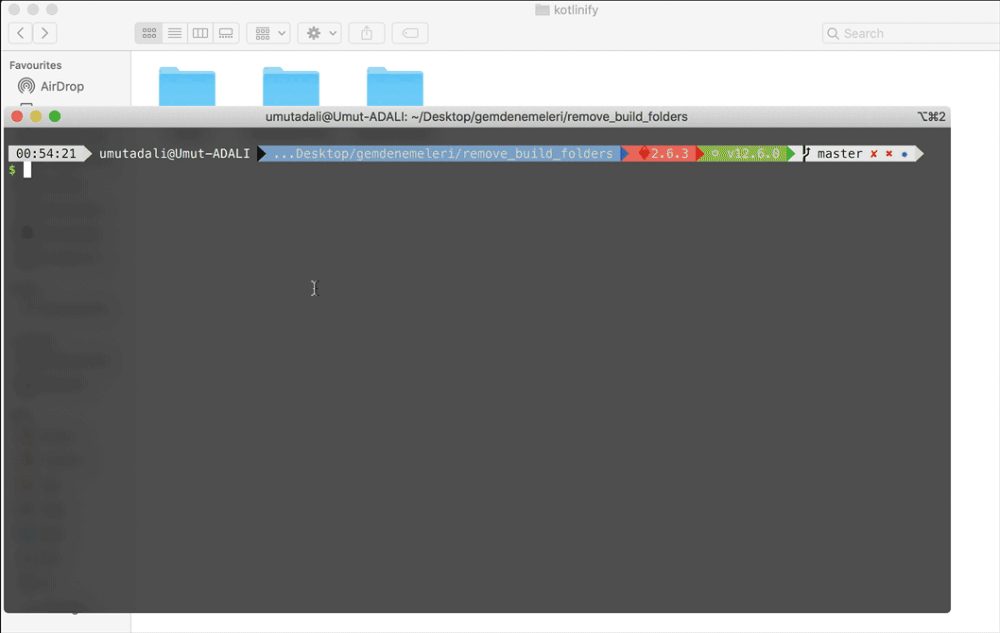

# RemoveBuildFolders

####  > English
In the following way, you can install this library with gem install method, remove_build_folders and select the folder path from the list and start automatic deletion. It will search all the folders under the selected folder and delete the folders named build.

####  > Türkçe
Aşağıdaki şekilde gem install metoduyla bu kütüphaneyi yükleyerek terminale remove_build_folders yazarak listeden klasör yolunu seçip otomatik silme işlemini başlatabilirsiniz. Seçtiğiniz klasör altındaki tüm klasörleri arayarak içerisinde build adında olan klasörleri silecektir.

## Attention

####  > English
It will delete all the folders named build in the selected folder. Watch out if you have important build folders!

####  > Türkçe
Seçtiğiniz klasör içindeki bütün build adlı klasörleri silecektir. Önemli build klasörleriniz varsa dikkat ediniz!

## Installation

    $ gem install remove_build_folders

## Usage

remove_build_folders to the terminal after installing then select folder in list or you can enter own path. Thats it.

## New Features
### Version: 0.1.8
Added current folder in folder list

## Development

After checking out the repo, run `bin/setup` to install dependencies. Then, run `rake test` to run the tests. You can also run `bin/console` for an interactive prompt that will allow you to experiment.

To install this gem onto your local machine, run `bundle exec rake install`. To release a new version, update the version number in `version.rb`, and then run `bundle exec rake release`, which will create a git tag for the version, push git commits and tags, and push the `.gem` file to [rubygems.org](https://rubygems.org).

## Contributing

Bug reports and pull requests are welcome on GitHub at https://github.com/kobeumut/remove_build_folders. This project is intended to be a safe, welcoming space for collaboration, and contributors are expected to adhere to the [Contributor Covenant](http://contributor-covenant.org) code of conduct.

## License

The gem is available as open source under the terms of the [MIT License](https://opensource.org/licenses/MIT).

## Code of Conduct

Everyone interacting in the RemoveBuildFolders project’s codebases, issue trackers, chat rooms and mailing lists is expected to follow the [code of conduct](https://github.com/kobeumut/remove_build_folders/blob/master/CODE_OF_CONDUCT.md).
